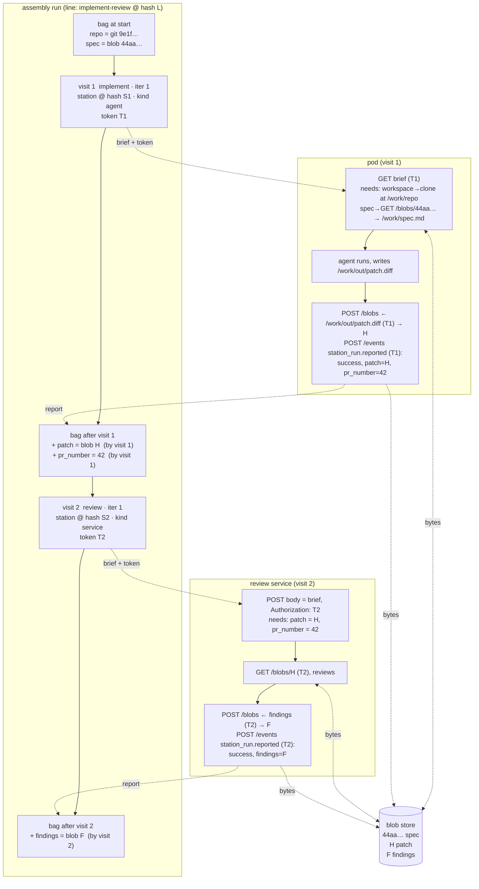

# Example: implement then review

One line, two stations, one file flowing from the first to the second.

## The stations

Each station is authored once and versioned by content hash. It declares what
it needs and what it produces, by name. It never says where anything comes
from.

```yaml
# station: implement  (kind: agent)
name: implement
kind: agent
agent_definition: implementer         # model, prompt, timeout, image; repo variant picked at open
conversation: new
needs:
  - { name: workspace, kind: git,   path: /work/repo }
  - { name: spec,      kind: file,  path: /work/spec.md }
produces:
  - { name: patch,     kind: file,  path: /work/out/patch.diff }
  - { name: pr_number, kind: value }
```

```yaml
# station: review  (kind: service)
name: review
kind: service
url: https://review.internal/api/stations/review
agent_definition: reviewer
conversation: new
needs:
  - { name: patch,     kind: file }        # no path: a service has no filesystem the floor cares about
  - { name: pr_number, kind: value }
produces:
  - { name: findings,  kind: file }
```

## The line

The line names the stations and wires the outcomes. It says nothing about
files either, because the names already match. `spec` is not produced by any
node, so it must be seeded at start, and the validator checks that.

```yaml
name: implement-review
entry: implement
exit: review
args:                                     # what /start must be given, typed
  repo:   { kind: git, subject: true }    # subject_key = "repo:<value>"; one open run per subject
  spec:   { kind: file }
nodes:
  - { id: implement, station: implement }               # start defaults to node.implement.start
  - { id: review,    station: review }                  # station: review@sha256:ab12… to pin a version
edges:
  - { from: implement, to: review, on: success }
  - { from: review,    to: implement, on: changes_requested, iteration_max: 2 }
```

If the review station had called its need `diff` instead of `patch`, the node
would say:

```yaml
  - { id: review, station: review, bind: { diff: patch } }
```

## Starting it

```http
POST /assembly-lines/implement-review/start
Idempotency-Key: 7f3c…

{ "args": { "repo":  { "kind": "git",  "repo": "re-cinq/lore", "sha": "9e1f…" },
            "spec": { "kind": "file", "blob": "sha256:44aa…" } } }
```

The spec blob was uploaded first with `POST /blobs`. Start writes the run row
with the line id and hash, seeds the bag with `repo` and `spec`, and posts
`node.implement.start`. The loop claims it and opens visit 1.

## The graph



Read it top to bottom on the left: the bag only ever grows, and each entry
says which visit wrote it. Read it left to right for one visit: the brief and
the token go out, the report comes back, and bytes only ever touch the blob
store.

## What lands in the tables

```
assembly_runs
  id=R  line_id=implement-review  line_hash=L  status=running
  bag = { repo:{git,9e1f…,by:start}, spec:{file,44aa…,by:start},
          patch:{file,H,by:v1}, pr_number:{value,42,by:v1}, findings:{file,F,by:v2} }

station_runs
  seq=1 station_run_id=v1 run=R node=implement iter=1 station_hash=S1 status=done
        input={needs:{workspace:{git,9e1f…}, spec:{file,44aa…}}}  report={success, produced:{patch:H, pr_number:42}}
  seq=2 station_run_id=v2 run=R node=review    iter=1 station_hash=S2 status=done
        input={needs:{patch:{file,H}, pr_number:{value,42}}}       report={success, produced:{findings:F}}
```

The events for this run, in order: `node.implement.start`,
`station_run.reported` (v1), `node.review.start`, `station_run.reported` (v2). That list plus the
blobs reconstructs everything above.

If review reports `changes_requested`, the kernel derives `launch(implement, 2)`,
the loop posts `node.implement.start` again, a third row opens with `iter=2`,
and its brief carries the same `spec` plus `findings` as an optional need.
