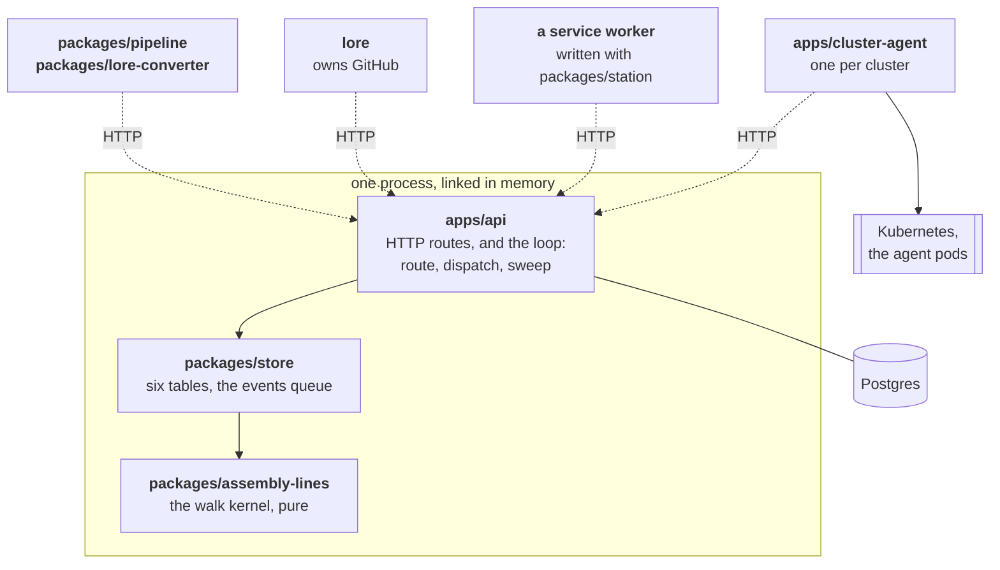
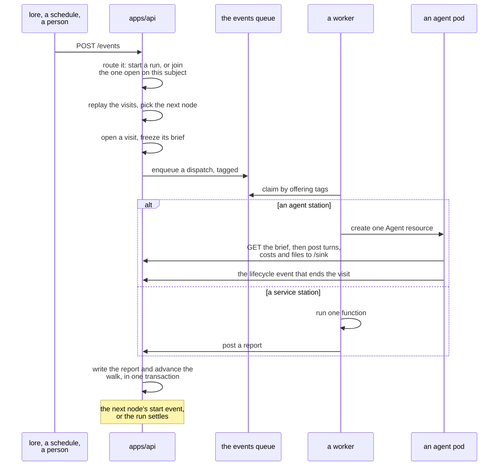

# floor

A workflow engine for pipelines of AI agents. Two words carry the whole model, and they are not
interchangeable:

- An **assembly line** is a *definition*: a graph of **nodes** and the edges between them, stored
  and versioned by its own content. It describes work; it never does any.
- An **assembly run** is *one execution* of one assembly line. Walking it opens a **visit** at each
  node it reaches, and a visit is worked by an agent in a pod, by a service worker, or by a person.

One assembly line has many assembly runs. Floor stores the definitions, decides what happens next,
and hands the work out — it does none of the work itself.

Vocabulary, from lore's ADR-024: `Factory ⊃ Floor ⊃ AssemblyLine ⊃ Station ⊃ Agent`.

## Three invariants the whole design hangs on

- **Floor holds no provider client.** No Kubernetes, no GitHub, no chat. Anything provider-shaped
  is a station or a separate app.
- **Floor never calls out.** Every worker pulls its own work from the queue. One exception, and it
  is deliberate: a pod's git credential, because git waits thirty seconds for an answer.
- **No code of ours runs inside an agent pod.** The
  [ai-agent-subsystem](https://github.com/re-cinq/ai-agent-subsystem)'s supervisor does that work.

A fourth, about state: **visits are the truth, events are how they change.** An assembly run's
status, its bag, its current node and its cost are all *derived* by replaying its visits. None of
them is stored.

## The map



A solid arrow is a dependency linked in memory; a dashed one is HTTP. Nothing points *out* of the
api: every worker calls in.

That split is the point. **Only `apps/api` links the store.** A worker cannot reach the database
even by accident, so the queue is the only way in, and a worker can live in another repository,
another language or another cluster without floor knowing.

## How an assembly run goes




1. **Something posts an event** to `POST /events` — a webhook feeder, a schedule tick, a person.
2. **The loop routes it.** One api replica holds a Postgres advisory lease and runs the loop; every
   replica still serves HTTP. The event starts an assembly run, or joins the run already open on
   its subject.
3. **The walk picks the next node** by replaying the run's visits — pure, in `assembly-lines`. The
   assembly line says what *may* happen; the run's own visits decide what happens next.
4. **A visit opens**, its brief frozen then and there: each need resolved from the run's bag, the
   station and agent definition pinned by content hash, a deadline set.
5. **A dispatch goes on the queue**, tagged. Nothing is pushed; workers claim by offering tags.
   - `kind:agent` → **`apps/cluster-agent`** claims it and creates one Agent resource. The
     subsystem runs the pod; the pod posts what it does back to `/station-runs/:id/sink`.
   - `station:<name>` → a **service worker** claims it, works, posts a report.
   - A **human** node dispatches nothing: it waits with no deadline. Floor serves no page for it —
     whoever maintains the station builds that, and answers with a report or an event.
   - A node with no station is a **marker**: it opens and reports success in one transaction.
6. **A report lands**, and in the same transaction the walk advances: the next node's start event,
   or the run settles.

The **bag** is the only channel between nodes, and it is write-forward only. A node declares what
it `needs` and what it `produces`; floor moves the bytes and nothing else crosses.

## The pieces

| piece | what it is |
|---|---|
| [`apps/api`](apps/api/README.md) | The HTTP API and the single-leased loop. The only process that touches Postgres. |
| [`apps/cluster-agent`](apps/cluster-agent/README.md) | The only process that talks to one cluster's Kubernetes API. Turns a dispatch into an agent pod. |
| [`packages/store`](packages/store/README.md) | Six tables, the definitions store, the events queue, and the run store. |
| [`packages/assembly-lines`](packages/assembly-lines/README.md) | The walk kernel: which edge is taken next, given the visits so far. Pure, no I/O. |
| [`packages/station`](packages/station/README.md) | The SDK a service station is written with: one function, and the claim loop around it. |
| [`packages/pipeline`](packages/pipeline/README.md) | A whole pipeline as one file, exported from or imported into a floor over HTTP. |
| [`packages/lore-converter`](packages/lore-converter/README.md) | Reads a lore checkout and writes the definitions this floor runs in its place. |
| [`deploy/chart`](deploy/chart/README.md) | One Helm chart, one image, both apps, toggled. |

**GitHub is not in this repository.** lore owns it: lore posts GitHub's events to `/events`, runs a
service station for every GitHub action an assembly line takes, and answers floor's git-credential
request.
Floor's own GitHub app was deleted — see [docs/decisions.md](docs/decisions.md), "GitHub".

## Getting started

**New here? [Follow the tutorial](docs/tutorial.md)** — install floor with Helm, register a cluster
to run agents in, import an assembly line, and start an assembly run of it. Five steps, each one
ending in something you can check.

To work on floor itself:

```
npm install
npm run db:up && npm run db:migrate    # Postgres on :5433
npm run build                          # before npm test: cross-package tests read dist
npm test && npm run typecheck && npm run lint
npm start                              # the dev loop, see docs/dev_loop.md
```

`scripts/walk-*.sh` walk a real run end to end against minikube.

## The documents

[docs/tutorial.md](docs/tutorial.md) is the way in: installing, registering a cluster, importing an
assembly line, and starting an assembly run of it. [docs/README.md](docs/README.md) is the index and states the contract the pages keep: they describe
the floor **as it runs**, anything designed but unwritten is marked **Not built yet**, and nothing
unmarked should be false. Start with [docs/assembly_run_storage.md](docs/assembly_run_storage.md)
for the model, [docs/api_sketch.md](docs/api_sketch.md) for the endpoints, and
[docs/decisions.md](docs/decisions.md) for why any of it is the way it is.
